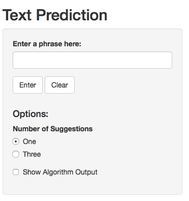

Description
-----------
This is a shiny app I wrote as part of the [Coursera Data Science Course](https://www.coursera.org/specializations/jhudatascience).
The program predicts the next word in a sentence based on text excerpts news articles, blogs, and twitter.

[Check out the app by clicking here!](https://kahale.shinyapps.io/TextPrediction)
